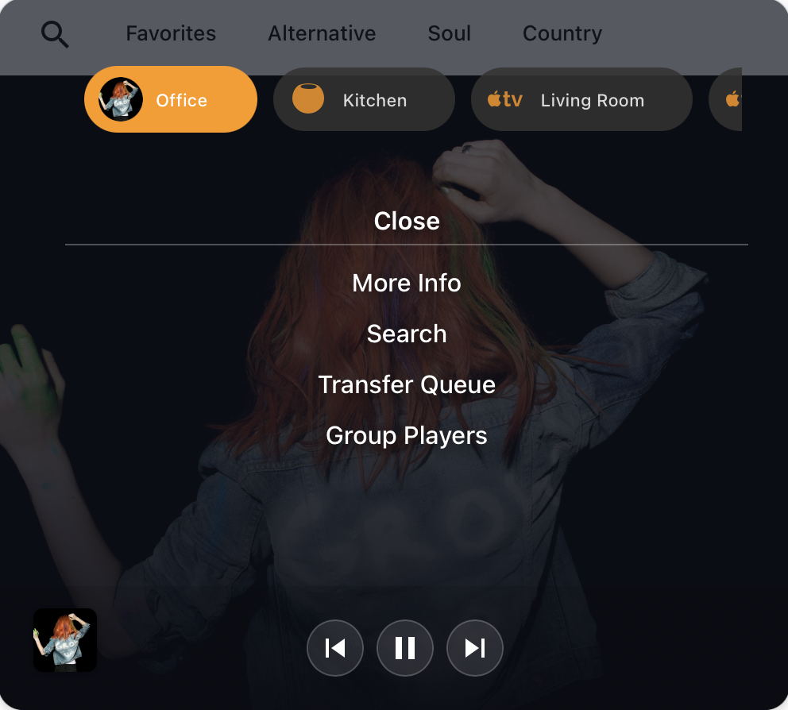
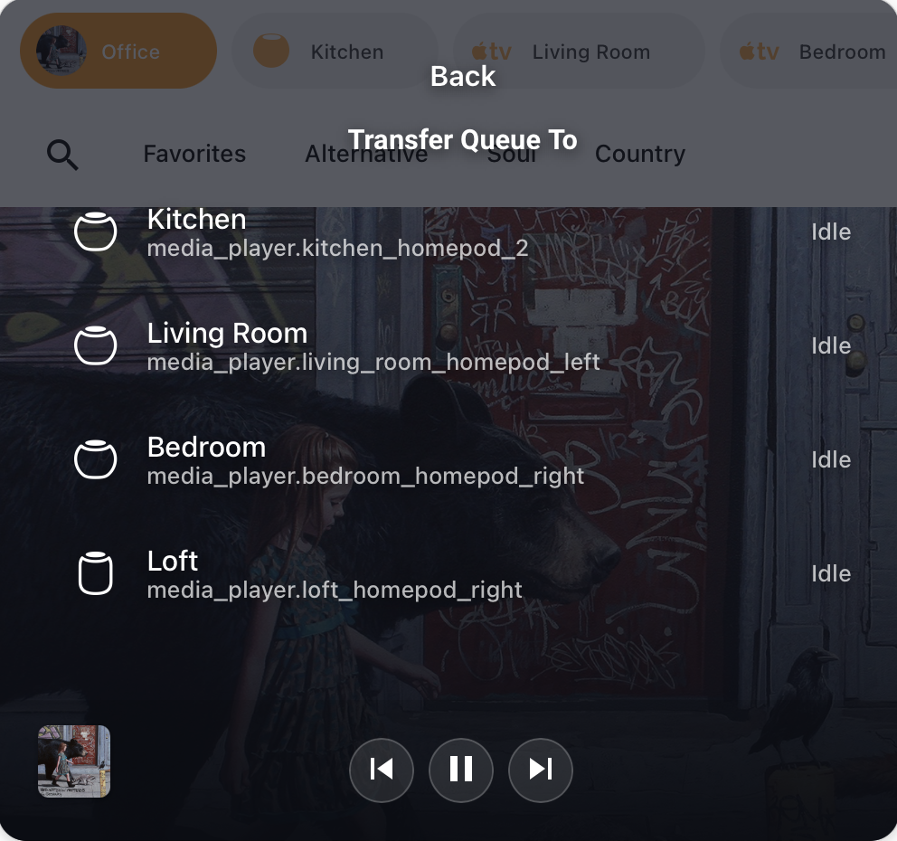
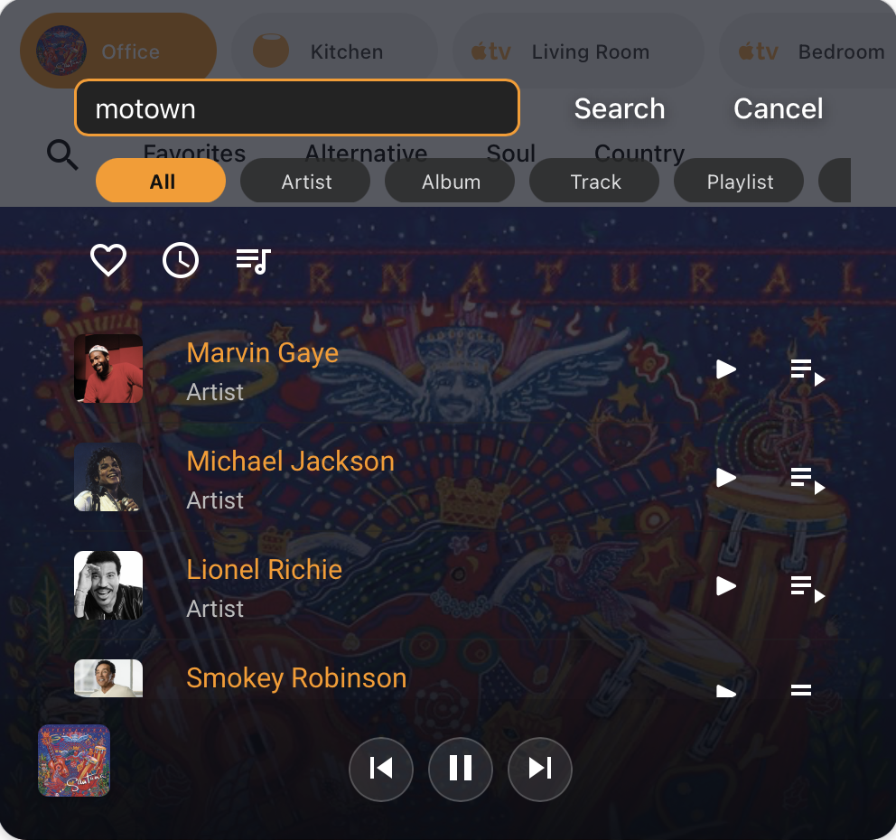

# Yet Another Media Player

YAMP is a full-featured Home Assistant media card for controlling multiple entities with customizable actions, music assistant support, and various layout options.


## Installation via HACS

[](https://my.home-assistant.io/redirect/hacs_repository/?repository=yet-another-media-player&category=dashboard&owner=jianyu-li)


## Features

- **Multi-Player Control** — Switch between media players in a single card with chip-based selection. Control volume individually or as a group
- **Gesture Controls** — Tap, double-tap, hold, or swipe the artwork to trigger any action. Skip tracks, play/pause, adjust volume, or launch custom scripts
- **Music Assistant Integration** — Full search, queue management, and transfer between compatible players without leaving the card
- **mass_queue Support** — Have even more control over your queue with the optional [mass_queue](https://github.com/droans/mass_queue) integration
- **Adaptive Visual Theming** — Customize artwork scaling with various fit modes and add custom artwork overrides
- **Many Layouts** — Collapse the card when idle or keep it compact while playing, change text sizing, and more to match your dashboard style
- **Custom Actions** — Add action chips or menu items that call any Home Assistant action or script, with full access to the currently selected entity
- **Idle Mode** — Display a custom background image when nothing is playing, from a local file, URL, or even a slideshow
- **Jinja Template Support** — Use Jinja templates for dynamic configuration of volume entities, Music Assistant entities, artwork overrides, and more

---

## Screenshots








---

## Basic Usage
Below you will find a list of all configuration options. 
- You can use music assistant actions in conjunction with "current" as the entity id and it will target whatever the current entity that is displayed in the card (e.g.: genres)

| **Option**                 | **Type**     | **Required** | **Default** | **Description**                                                                                 |
|----------------------------|--------------|--------------|-------------|-------------------------------------------------------------------------------------------------|
| **Entities**               |              |              |             |                                                                                                 |
| `type`                     | string       | Yes          | —           | `custom:yet-another-media-player`                                                               |
| `entities`                 | string/array | Yes          | —           | List of your media player entities                                                              |
| `volume_entity`            | string       | No           | —           | Separate entity for volume control (e.g., a remote for CEC TV volume) (supports Jinja templates) |
| `follow_active_volume`     | boolean      | No           | `false`     | Make volume entity follow the active playback entity                                            |
| `music_assistant_entity`   | string       | No           | —           | Music Assistant entity for search/grouping (supports Jinja templates)                            |
| `group_volume`             | boolean      | No           | `auto`      | Override default group volume logic for grouped players                                         |
| `sync_power`               | boolean      | No           | `false`     | Power on/off the volume entity with your main entity                                            |
| `hidden_controls`          | array        | No           | `[]`        | Array of control names to hide for this specific entity         |
| `hidden_filter_chips`      | array        | No           | `[]`        | Hide specific search filter chips for this entity (UI only; does not change search results) |
| `disable_auto_select`      | boolean      | No           | `false`     | Prevents the card from automatically switching to this entity when playback starts, even if it is a group master |
|                                                                                                 |
| **Behavior**               |              |              |             |                                                                                                 |
| `collapse_on_idle`         | boolean      | No           | `false`     | Collapse the card when nothing is playing                                                       |
| `always_collapsed`         | boolean      | No           | `false`     | Keep the card collapsed even when something is playing                                          |
| `expand_on_search`         | boolean      | No           | `false`     | Temporarily expand the card when search is open (only available when `always_collapsed` is `true`) |
| `hide_menu_player`         | boolean      | No           | `false`     | Hide the persistent media controls in the bottom sheet menu to reclaim space (only available when `always_collapsed` is `false`) |
| `idle_screen`              | choice       | No           | `default`   | Choose the idle experience: `default` keeps the artwork splash, `search` opens the search sheet immediately, `search-recently-played` jumps to the Recently Played view, and `search-next-up` opens the Next Up queue |
| `dim_chips_on_idle`        | boolean      | No           | `true`      | Dim entity and action chips when the media player is idle                                       |
|                                                                                                 |
| **Search**                 |              |              |             |                                                                                                 |
| `search_results_limit`     | number       | No           | `20`        | Maximum number of results to request per media category (artist/album/track/etc.) across favorites, recently played, and standard searches; set to `0` to fall back to Music Assistant’s own limits |
| `search_results_sort`      | choice       | No           | `default`   | Order search results by `default`, `title_asc`, `title_desc`, `artist_asc`, or `artist_desc`; sorting happens within the results returned by `search_results_limit` |
| `disable_autofocus`        | boolean      | No           | `false`     | Prevent the search box from auto-focusing so on-screen keyboards stay hidden when opening search sheets |
| `keep_filters_on_search`   | boolean      | No           | `false`     | Enable this to search within the current active filter (Favorites, etc) instead of clearing it |
| `pin_search_headers`       | boolean      | No           | `false`     | Always keep search and menu headers pinned at the top while scrolling through results           |
| `hide_search_headers_on_idle` | boolean    | No           | `false`     | Hide search input and filters when the player is idle                                           |
| `disable_mass_queue`       | boolean      | No           | `false`     | Disable the optional mass_queue integration even if it is installed |
|                                                                                                 |
| **Look and Feel**          |              |              |             |                                                                                                 |
| `match_theme`              | boolean      | No           | `false`     | Updates card accent colors to match your Home Assistant theme                                   |
| `display_timestamps`       | boolean      | No           | `false`     | Display timestamps on the progress bar                                                          |
| `show_chip_row`            | choice       | No           | `auto`      | `auto`: hides chip row if only one entity, `always`: always shows the chip row, `in_menu`: moves chips into the entity-options menu, `in_menu_on_idle`: shows chips inline when active but moves them to the menu when idle |
| `alternate_progress_bar`   | boolean      | No           | `false`     | Uses the collapsed progress bar when expanded                                                   |
| `adaptive_controls`        | boolean      | No           | `false`     | Control buttons expand to fill extra horizontal space, giving you larger tap targets when there’s room |
| `control_layout`           | choice       | No           | `classic`   | `classic` keeps the legacy evenly sized controls, while `modern` adopts Home Assistant’s more-info layout (shuffle/prev/play/next/repeat) and moves the favorite and power buttons along the bottom of the card |
| `swap_pause_for_stop`      | boolean      | No           | `false`     | Only for `control_layout: modern`; when `true`, the center pause button is replaced with a stop button |
| `adaptive_text`            | boolean/array| No           | `false`     | Set to `true` to scale all text, or supply a list of targets (`details`, `menu`, `action_chips`) to choose exactly which sections adapt |
| `hide_active_entity_label` | boolean      | No           | `false`     | Hide the small entity name label shown at the bottom center when chips are placed in the menu |
| `card_height`              | number       | No           | —           | Override the card height (in px); leave unset to use the default layout                          |
| `search_view`              | choice       | No           | `list`      | Choose the default layout for search results: `list` or `card`  |
| `search_card_columns`      | number       | No           | `4`         | Number of columns for search results when `search_view` is set to `card` |
|                                                                                                 |
| **Artwork**                |              |              |             |                                                                                                 |
| `artwork_hostname`         | string       | No           | —           | Hostname URL (e.g., `http://192.168.1.50:8123`) prepended to relative artwork URLs; required when Casting to external devices |
| `artwork_object_fit`       | choice       | No           | `cover`     | Control how artwork scales: `cover`, `contain`, `scaled-contain`, `fill`, `scale-down`, or `none` |
| `artwork_position`         | choice       | No           | `top center`| Control artwork alignment: `top center`, `center center`, or `bottom center`                     |
| `extend_artwork`           | boolean      | No           | `false`     | When `true`, extends the artwork background up behind the chip and action rows for a full-bleed look |
| `media_artwork_overrides`  | array        | No           | —           | Ordered artwork override rules. Provide an `image_url` and a single match key (title, artist, album, content id, channel, app name, content type, or entity) or supply `missing_art_url`; optional `size_percentage` and `object_fit` can be used to style the replacement (defaults to global `artwork_object_fit`). `image_url`/`missing_art_url` can be literal URLs or templates that resolve to one |
| `idle_image`               | image/camera/url/template | No           | —           | Background image when player is idle (supports local files, cameras, URLs, or templates that return either)                   |
| `idle_timeout_ms`          | number       | No           | `60000`         | Timeout in milliseconds before showing idle image (0 = never go idle)                           |
|                                                                                                 |
| **Actions**                |              |              |             | (Each chip/action can have any/all of the below)                                                |
| `transfer_queue`           | menu action  | No           | —           | Adds a "Transfer Queue" menu action for Music Assistant entities (see below)                   |
| `name`                     | string       | No           | —           | Name for the action chip                                                                        |
| `icon`                     | string       | No           | —           | MDI or custom icon for the action chip                                                          |
| `service`                  | string       | No           | —           | Home Assistant service to call (e.g., `media_player.play_media`)                                |
| `service_data`             | object       | No           | —           | Data to send with the service call                                                              |
| `action`                   | string       | No           | —           | Set to `navigate` for navigation shortcuts or `sync_selected_entity` to sync the active entity to a helper |
| `navigation_path`          | string       | No           | —           | Destination for navigation shortcuts (supports anchors like `#pop-up-menu`, relative paths, or full URLs) |
| `navigation_new_tab`       | boolean      | No           | `false`     | When `true`, external URLs open in a new browser tab instead of replacing the current view      |
| `menu_item`                | string       | No           | —           | Opens a card menu by type: `search`, `search-recently-played`, `search-next-up`, `source`, `more-info`, `group-players`, `transfer-queue` |
| `in_menu`                  | choice       | No           | `false`     | Placement of the action: `false` (Action Chip), `true` (In Menu), or `hidden` (Hidden - only triggerable via card gestures) |
| `card_trigger`             | choice       | No           | `none`      | Assign action to a card-level gesture: `none`, `tap`, `hold`, `double_tap`, `swipe_left`, or `swipe_right` (only for `hidden` actions) |
| `script_variable`          | boolean      | No           | `false`     | Pass the currently selected entity as `yamp_entity` to a script                                 |
| `sync_entity_helper`       | string       | No           | —           | `input_text` entity to sync the currently selected entity to (used with `action: sync_selected_entity`) |


# Entities

## Entities
> Add the media players you want to control. Drag entities to reorder the chip row.

### Music Assistant Entity Configuration

You can associate a Music Assistant entity with any media player to enable search and grouping functionality. Since Music Assistant creates a "duplicate" companion entity, you can essentially use this function to combine the main entity with the music assistant companion entity into a single chip.

This is also particularly useful for Universal Media Player (UMP) setups where you want physical control (amp power, source switching) through the main entity while using Music Assistant for advanced media features. When the card is actively using the music assistant entity, the chip will have an indicator outline.

**Favorite Button**: When using a Music Assistant entity, a favorite button (heart icon) will appear in the controls, allowing you to favorite the currently playing track. The button will only appear if you have a button entity configured with "favorite" or "like" in its name (e.g., `button.favorite_track` or `button.like_song`).

#### Basic Example
```yaml
type: custom:yet-another-media-player
entities:
  - entity_id: media_player.kitchen_homepod
    name: Kitchen
    music_assistant_entity: media_player.kitchen_homepod_2
```

#### Jinja Template Example
For advanced users, you can use Jinja templates to dynamically select the Music Assistant entity:

```yaml
type: custom:yet-another-media-player
entities:
  - entity_id: media_player.kitchen_homepod
    name: Kitchen
    music_assistant_entity: |
      
        media_player.office_homepod_2
      
        media_player.kitchen_homepod_2
      
```

### Hidden Search Filter Chips (Per-Entity)

You can hide specific search filter chips on a per-entity basis using `hidden_filter_chips`. This only affects the chip UI; it does not change the underlying search results or API calls. It’s useful for focusing the search UI on the media types you care about.

#### Available Chip Names
- `artist`
- `album`
- `track`
- `playlist`
- `radio`
- `podcast`
- `episode`

#### Example Configuration
```yaml
type: custom:yet-another-media-player
entities:
  - entity_id: media_player.office_homepod
    name: Office
    music_assistant_entity: media_player.office_homepod_2
    hidden_filter_chips:
      - artist
      - album
      - track
      - podcast
```

### Disable Auto-Select (Per-Entity)

Use `disable_auto_select: true` to prevent the card from automatically jumping to a specific entity when it starts playing. 

**When enabled for an entity:**
- The card will **not** auto-switch to this chip when it starts playing.
- The card will **not** auto-switch to this chip if it becomes the master of a group (unless you manually select it first).
- The chip will **not** re-order to the front of the chip row when it begins playing.
- The card will **not** wake from idle mode if this is the only active player.


### Group Players
Player entities can be grouped together for supported entities. Access the hamburger menu and choose "Group Players" to see a list of supported players that are currently configured on your card. If no players are supported (or only one entity is) then the "Group Players" option will not be visible. 
- Grouped entities will increase and decrease proportionately with the main entity. 
  - If only one entity is configured, and it is part of a group, only the volume for that entity will change. See `group_volume` for additional configuration options.
- Use the Grouped Players menu to adjust individual player volume or to sync the volume percentage across all grouped players to the main entity
    
### Transfer Queue

The card can surface a **Transfer Queue** menu option for Music Assistant players. When the active entity supports queue transfers, selecting *Transfer Queue* opens a list of compatible targets and the queue moves instantly to the chosen player. The option only appears when a Music Assistant entity with a queue is selected.

### Volume Entity Configuration

You can use a separate `volume_entity` for volume display and control. This can be a static entity or a Jinja template that resolves to an entity id (e.g., `media_player.*` or `remote.*`). If `sync_power` is enabled, the resolved volume entity will be powered on/off along with the main entity.

#### Follow Active Entity

You can also enable `follow_active_volume` to make the volume entity automatically follow the active playback entity. This is useful when you want volume controls to always target the entity that is currently playing, regardless of which chip is selected.

**Note**: When `follow_active_volume` is enabled, the sync power toggle will be automatically hidden in the config editor since it's not applicable in this mode.

```yaml
type: custom:yet-another-media-player
entities:
  - entity_id: media_player.living_room_apple_tv
    name: Living Room
    follow_active_volume: true
  - entity_id: media_player.kitchen_homepod
    name: Kitchen
    follow_active_volume: true
```

#### Basic Example
```yaml
type: custom:yet-another-media-player
entities:
  - entity_id: media_player.living_room_apple_tv
    name: Living Room
    volume_entity: remote.living_room_apple_tv
    sync_power: true
```

#### Jinja Template Example
```yaml
type: custom:yet-another-media-player
entities:
  - entity_id: media_player.office_homepod
    name: Office
    volume_entity: |
      
        remote.soundbar
      
        media_player.office_homepod
      
    sync_power: true
```

### Hidden Controls Configuration

You can hide specific media player controls on a per-entity basis using the `hidden_controls` option. This is useful when you want to simplify the interface for certain entities or hide controls that aren't needed.

**Important**: The entity must still support the control for it to be visible in the first place. Hidden controls only hide controls that would normally be displayed based on the entity's capabilities.

#### Available Control Names
- `previous` - Previous Track button
- `play_pause` - Play/Pause button  
- `stop` - Stop button
- `next` - Next Track button
- `shuffle` - Shuffle button
- `repeat` - Repeat button
- `favorite` - Favorite button (requires Music Assistant entity)
- `power` - Power on/off button

#### Example Configuration
```yaml
type: custom:yet-another-media-player
entities:
  - entity_id: media_player.living_room_apple_tv
    name: Living Room
    hidden_controls:
      - favorite
      - shuffle
      - repeat
  - entity_id: media_player.kitchen_homepod
    name: Kitchen
    hidden_controls:
      - power
```

In this example:
- The Living Room entity will hide the favorite, shuffle, and repeat buttons
- The Kitchen entity will hide only the power button
- All other controls will remain visible (if supported by the entity)


# Behavior

## Idle & Chips
> Choose when the card goes idle and how entity chips behave.

- **Idle Timeout**: Time in milliseconds before the card enters idle mode. Set to 0 to disable idle behavior.
- **Dim Chips on Idle**: When enabled, entity and action chips will dim when the media player is idle.
- **Show Chip Row**: "Auto" hides the chip row when only one entity is configured. "In Menu" moves the chips into the menu overlay. "In Menu on Idle" shows chips inline when active but moves them to the menu when idle.

## Interactions & Search
> Fine-tune how entities are pinned and how many results show at once.

- **Hold to Pin**: Long press on entity chips instead of short press to pin them, preventing auto-switching during playback.
- **Pin Search Headers**: Enable this to pin the header of search and grouping sheets. This keeps the "Back" and "Close" buttons always accessible while you scroll through long lists of results or players.
- **Disable Search Autofocus**: Keep the search box from stealing focus so on-screen keyboards stay hidden.
- **Keep Filters on Search**: Enable this to search within the current active filter (Favorites, Recently Played, etc) instead of clearing it.
- **Hide Search Headers on Idle**: Use with `idle_screen: search` and `search_view: card` to create a nice landing page. 

### Search
Initiate a search using the hamburger menu and selecting `search`. Press Enter or click the `search` button after inputing your search query. To exit, click `cancel` or Esc on your keyboard. 
- **Favorites Filter**: Toggle the favorites button to show only favorited tracks
- **Recently Played Filter**: Toggle the recently played button to show your most recently played items. When enabled, results are fetched from Music Assistant ordered by most recently played. Only items that are part of your library will appear. You can still use the media-type chips to narrow the list. Submitting a new search query will start a normal search and turn off filters.
- **Next Up Filter**: Toggle the next up button to show the upcoming track in your queue. 
  - Install mass_queue to see and manage the entire upcoming queue! See documentation for Music Assistant Queue Actions below. 
- **Enqueue Actions**: Click the 3-dot menu (`dots-vertical`) on any search result to access four enqueue strategies:
  - **Replace**: Clears the current queue and plays the selection immediately.
  - **Next**: Adds the selection to the queue immediately after the currently playing track.
  - **Replace Next**: Replaces all upcoming items in the queue with the selection, starting after the current track.
  - **Add to Queue**: Adds the selection to the very end of the queue.
- Bonus Tip: Click or tap the artist name on a currently playing track to initiate a search on that artist!


### Search Results Limit Configuration

You can configure the maximum number of search results to display using the `search_results_limit` option. This value is applied to each media category (e.g., artists, albums, tracks, playlists) that Music Assistant returns before the results are flattened together, so the total count in the UI can exceed the configured limit when multiple categories are shown. Setting the limit to `0` tells the card not to constrain the request; Music Assistant will still apply its own default caps, so the results are not truly unlimited.

#### Configuration Options
- **Default**: 20 results
- **Range**: 0-1000 results
- **Music Assistant default**: Set to `0` to defer to Music Assistant’s built-in limits (not unlimited)
- **Note**: Higher limits may increase load time and memory usage when rendering large result sets.
- **Scope**: Global setting that applies to all entities and search types

#### Example Configuration
```yaml
type: custom:yet-another-media-player-alpha
search_results_limit: 50
entities:
  - entity_id: media_player.living_room_apple_tv
    name: Living Room
  - entity_id: media_player.kitchen_homepod
    name: Kitchen
```

### Result Sorting Configuration

Use the `search_results_sort` option to change how search results are ordered. The default behavior keeps the original order returned by the music service. Sorting is applied within the results already constrained by `search_results_limit`. Available values are:

- `default` (source order)
- `title_asc`
- `title_desc`
- `artist_asc`
- `artist_desc`

#### Example Configuration
```yaml
type: custom:yet-another-media-player-alpha
search_results_sort: title_asc
entities:
  - entity_id: media_player.office_homepod
    name: Office
```

### Optional: Music Assistant Queue Actions (mass_queue)

For enhanced queue controls in the Search sheet (e.g., viewing and reordering the upcoming queue, moving items up/down/next, and removing items), you can optionally install the community integration that adds Music Assistant queue services.

- Integration: `mass_queue` — Actions to control player queues for Music Assistant
- Install via HACS or manual install as described in the integration’s README
- Repository link: [droans/mass_queue](https://github.com/droans/mass_queue)

Once installed and configured, YAMP will automatically detect the integration and enable:
- Fetching the upcoming queue with `mass_queue.get_queue_items` (the existing ```search_results_limit``` will be used for this)
- Queue item reordering: move up, move down, move next
- Queue item removal

These features are optional. Without the integration, YAMP will fall back to a basic “next up” preview when available.


# Look and Feel

## Theme & Layout
> Match dashboard styling and control the overall footprint.

- **Match Theme**: Updates card accent colors to match your Home Assistant theme.
- **Display Timestamps**: Display timestamps on the progress bar.
- **Alternate Progress Bar**: Uses the collapsed progress bar when expanded.
- **Card Height**: Override the card height (in px); leave unset to use the default layout.

## Controls & Typography
> Tune button sizing, entity labels, and adaptive text.

### Control Layouts
Use `control_layout` to swap between the legacy `classic` row and the new `modern` Home Assistant–style buttons. `classic` keeps every control in one evenly sized row. `modern` mirrors the more-info pop-out: shuffle → previous → play/pause → next → repeat stay inline with a larger center button, and moves the favorite and power buttons in the volume row. When `control_layout` is set to `modern`, you can also enable `swap_pause_for_stop` to replace the center pause button with a stop button.


### Adaptive Control Size
Some dashboards give the card a ton of horizontal space which previously resulted in big gaps between the playback controls. Set `adaptive_controls: true` to have each control button stretch and gain padding as space becomes available, producing larger and easier-to-press targets without impacting compact layouts.

### Adaptive Text Size
Enable adaptive text when you’d like titles, menu entries, or chips to scale with the space your dashboard gives the card. Smaller cards tighten the typography to avoid wrapping, while roomy layouts increase the font size for easier readability. You can either set `adaptive_text: true` to scale everything, or specify the exact sections via `adaptive_text_targets`:

```yaml
adaptive_text_targets:
  - details        # now playing title/artist
  - menu           # menu + search sheets
  - action_chips   # action chips on the card
```

### Card Mod Examples

#### Increase font size for details row
Even if `adaptive_text_targets` is configured, the text still won't grow until the card goes over 300px. To adjust sizing for shorter cards, you can use this card-mod and adjust to your liking
```
card_mod:
  style: |
    .details {
      font-size: 2.4em !important;      # overall scaling
    }
    .details .title {
      font-size: 1.6em !important;      # optional: title only
    }
    .details .artist {
      font-size: 1.2em !important;      # optional: artist only
    }
```

## Collapsed & Idle States
> Control when the card collapses and which views show while idle.

- **Collapse on Idle**: Collapse the card when nothing is playing.
- **Always Collapsed**: Keep the card collapsed even when something is playing.
- **Hide Menu Player**: Hide the persistent media controls in the bottom sheet menu to reclaim space.

### Expand on Search Example
When using `always_collapsed: true`, you can enable `expand_on_search: true` to temporarily expand the card to its normal size when the search interface is open:

```yaml
type: custom:yet-another-media-player
entities:
  - media_player.living_room_apple_tv
  - media_player.kitchen_homepod
actions:
  - icon: mdi:magnify
    menu_item: search
always_collapsed: true
expand_on_search: true
```

### Idle Screen Search Mode
Prefer jumping straight into browsing? Set `idle_screen` to one of the search shortcuts to skip the idle artwork splash automatically:

- `idle_screen: search` opens the standard search view
- `idle_screen: search-recently-played` jumps directly to the Recently Played filter
- `idle_screen: search-next-up` shows the Next Up queue

```yaml
idle_screen: search-recently-played
```


# Artwork

## Artwork Fit & Position
> Controls how artwork scales and aligns across the card.

- **Artwork Fit**: Control how artwork scales: `cover`, `contain`, `scaled-contain`, `fill`, `scale-down`, or `none`. Use `scaled-contain` for a sharp inset image with a full-card blurred background.
- **Artwork Position**: Alignment of the artwork within the space (e.g., `top center`).
- **Extend Artwork**: When `true`, extends the artwork background up behind the chip and action rows for a full-bleed look. Automatically enabled for `scaled-contain`.

## Artwork Hostname (For Casting)
> Fixes artwork visibility when casting the dashboard to external displays (Nest Hub, etc.).

If you see broken images when casting, it's likely because the artwork URL is relative (e.g., `/api/image...`). External devices don't know the IP address of your Home Assistant instance.
Set `artwork_hostname` to your full HA URL (e.g., `http://192.168.1.50:8123`) so the card can create a valid absolute URL for these devices.

## Idle Artwork
> Show a static image or entity snapshot whenever nothing is playing.

- **Idle Image**: Background image when player is idle (supports local files, cameras, URLs, or templates that return either).

## Artwork Overrides
> Overrides are evaluated from top to bottom. Drag to reorder.

Use `media_artwork_overrides` to replace missing or low-resolution art with higher quality images. Rules are evaluated from top to bottom; the first match wins. Supply an `image_url` along with a single match key (`media_title`, `media_artist`, `media_album_name`, `media_content_id`, `media_channel`, `app_name`, `media_content_type`, or `entity_id`). Matches support wildcards (e.g., `media_title: "*"` matches any title). To cover any track that ships without art, use `missing_art_url` instead of a match value.

The following optional parameters can be used to style individual overrides:
- **`size_percentage`**: Scale the artwork relative to its container (e.g. `50`).
- **`object_fit`**: Control scaling behavior for this specific override: `cover`, `contain`, `scaled-contain`, `fill`, `scale-down`, or `none`. If omitted (or set to `default` in the editor), it inherits the global `artwork_object_fit` setting.

```yaml
media_artwork_overrides:
  - image_url: >-
      https://upload.wikimedia.org/wikipedia/commons/6/62/YouTube_social_white_square_%282024%29.svg
    app_name: YouTube
  - image_url: https://shine1049.org/files/Stack%20Images/shine104.9.png?ade9fb8c3c
    media_content_id: library://radio/2
  - image_url: >-
      https://www.freepnglogos.com/uploads/youtube-tv-png/youtube-tv-youtube-watch-record-live-apk-download-from-moboplay-21.png
    app_name: YouTube TV
  - image_url: /local/images/KROQ.png
    media_artist: KROQ
  - missing_art_url: /local/images/default_station.png
  - image_url: "{{ states('sensor.bg_img_url') }}"
    entity_id: media_player.office_homepod_2
```


# Actions

## Actions
> Build the action chips that appear in the card or its menu. Drag to reorder, click the pencil to configure each action.


### Custom Actions
You can also set mdi icons in the custom actions. This helps differentiate between music related actions and tv related actions. 

```yaml
actions:
  - icon: mdi:magnify
    menu_item: search
  - name: Grunge
    service: music_assistant.play_media
    icon: mdi:music
    service_data:
      entity_id: current
      media_id: apple_music://playlist/pl.5feba9fd5ea441a29aeb3597c8314384
      enqueue: replace
  - name: Play Bluey
    icon: mdi:television-play
    service: script.play_bluey_on_living    
```

### Menu-only Actions
When configuring an action you can enable the **In Menu** toggle (or set `in_menu: true` in YAML) to move that action out of the chip row. Menu-only actions appear with the built-in options at the bottom of the entity menu, preserving the same hover styling and icon color as items like *More Info* or *Transfer Queue*.

```yaml
actions:
  - name: Group Players
    icon: mdi:account-multiple-plus
    in_menu: true
    service: media_player.join
    service_data:
      entity_id: current
      group_members:
        - media_player.kitchen_homepod
```

### Navigation Actions
Jump straight to another dashboard view or pop-up by creating a navigation action. Choose **Navigate** in the editor (or set `action: navigate`) and supply the target with `navigation_path`.

```yaml
actions:
  - name: Living Room View
    icon: mdi:television
    action: navigate
    navigation_path: "#living"
```

To launch an external site in a new browser tab:

```yaml
actions:
  - name: Player Docs
    icon: mdi:open-in-new
    action: navigate
    navigation_path: "https://example.com/docs"
    navigation_new_tab: true
```

### Sync Selected Entity Action

Use the **Sync Selected Entity** action to automatically keep an `input_text` helper in sync with the currently selected media player. This is useful for automations that need to know which entity is active in the card.

#### Example Configuration

First, create an `input_text` helper in Home Assistant (e.g., `input_text.yamp_selected_entity`).

```yaml
type: custom:yet-another-media-player
entities:
  - media_player.living_room_apple_tv
  - media_player.kitchen_homepod
actions:
  - action: sync_selected_entity
    sync_entity_helper: input_text.yamp_selected_entity
    in_menu: hidden
```

> [!NOTE]
> For **Sync Selected Entity** actions, the placement is automatically set to `hidden` and triggers are disabled, as this action runs in the background.

### Gesture Triggers (Hidden Actions)

You can assign actions to card-level gestures on the artwork area by setting `in_menu: hidden` and choosing a `card_trigger`.

Available triggers:
- `tap` - Single tap on the artwork
- `hold` - Long press on the artwork
- `double_tap` - Double tap on the artwork
- `swipe_left` - Swipe left across the artwork
- `swipe_right` - Swipe right across the artwork

```yaml
actions:
  - icon: mdi:information
    menu_item: more-info
    in_menu: hidden
    card_trigger: tap
  - icon: mdi:magnify
    menu_item: search
    in_menu: hidden
    card_trigger: hold
  - icon: mdi:power
    service: media_player.toggle
    service_data:
      entity_id: current
    in_menu: hidden
    card_trigger: double_tap
  - service: media_player.media_next_track
    service_data:
      entity_id: current
    in_menu: hidden
    card_trigger: swipe_left
  - service: media_player.media_previous_track
    service_data:
      entity_id: current
    in_menu: hidden
    card_trigger: swipe_right
```

#### Gesture-Only Card Example

Create a minimal, gesture-controlled card by hiding all playback controls and relying entirely on taps and swipes:

```
type: custom:yet-another-media-player
entities:
  - entity_id: media_player.office_homepod
    name: Office
    hidden_controls:
      - previous
      - play_pause
      - stop
      - next
      - shuffle
      - repeat
      - favorite
      - power
show_chip_row: in_menu
actions:
  - service: media_player.media_play_pause
    service_data:
      entity_id: current
    in_menu: hidden
    card_trigger: tap
    name: Play/Pause
  - in_menu: hidden
    card_trigger: hold
    name: Volume Down
    service: media_player.volume_down
    service_data:
      entity_id: current
  - in_menu: hidden
    card_trigger: double_tap
    service: media_player.volume_up
    service_data:
      entity_id: current
    name: Volume Up
  - service: media_player.media_next_track
    service_data:
      entity_id: current
    in_menu: hidden
    card_trigger: swipe_left
    name: Next Track
  - service: media_player.media_previous_track
    service_data:
      entity_id: current
    in_menu: hidden
    card_trigger: swipe_right
    name: Previous Track
alternate_progress_bar: true
volume_mode: hidden

```

This configuration:
- Hides all playback controls for a clean look
- **Tap** to play/pause
- **Hold** to turn volume down
- **Double tap** to turn volume up
- **Swipe left** to skip to next track
- **Swipe right** to go to previous track

#### Example Automation

```yaml
alias: Adjust Lights Based on Selected Player
trigger:
  - platform: state
    entity_id: input_text.yamp_selected_entity
action:
  - choose:
      - conditions:
          - condition: state
            entity_id: input_text.yamp_selected_entity
            state: media_player.living_room_apple_tv
        sequence:
          - service: light.turn_on
            target:
              entity_id: light.living_room
            data:
              brightness_pct: 50
      - conditions:
          - condition: state
            entity_id: input_text.yamp_selected_entity
            state: media_player.kitchen_homepod
        sequence:
          - service: light.turn_on
            target:
              entity_id: light.kitchen
            data:
              brightness_pct: 75
```

### Passing Current Entity to a Script

#### Example YAML config
```yaml
type: custom:yet-another-media-player-beta
entities:
  - media_player.office_speaker_airplay
actions:
  - name: Set the Mood
    icon: mdi:heart
    service: script.set_mood
    script_variable: true
```    

#### Example Script
```yaml
alias: set_mood
mode: single
fields:
  yamp_entity:
    description: Target media player (MA entity if configured, else main entity)
  yamp_main_entity:
    description: Main configured entity
  yamp_playback_entity:
    description: Currently active playback entity
sequence:
  - action: light.turn_off
    metadata: {}
    data: {}
    target:
      entity_id: light.bedroom
  - action: switch.turn_on
    metadata: {}
    data: {}
    target:
      entity_id: switch.fireplace
  - service: music_assistant.play_media
    data:
      entity_id: "{{ yamp_entity }}"
      media_id: apple_music://track/1445094678
      enqueue: replace
```

**Available Script Variables:**
- `yamp_entity`: The Music Assistant entity if configured, otherwise the main entity
- `yamp_main_entity`: The main configured entity
- `yamp_playback_entity`: The currently active playback entity (MA or main)  

### Input Source Actions
With [custom brand icons](https://github.com/elax46/custom-brand-icons) (also available on HACS), you can set up source actions with the providers logo.
Use the "name" argument to include a name or leave it off for icon only

```yaml
actions:
  - icon: phu:netflix
    service: media_player.select_source
    service_data:
      entity_id: current
      source: Netflix
  - icon: phu:youtube
    service: media_player.select_source
    service_data:
      entity_id: current
      source: YouTube
  - icon: phu:hulu
    service: media_player.select_source
    service_data:
      entity_id: current
      source: Hulu
```

### Radio Station Service Action
Example action for playing a radio station on [Chromecast](https://www.home-assistant.io/integrations/cast/). This also pushes an image to chromecast devices with a screen with the station (submitted by @rafaelmagic). 

```yaml
- name: 🎷 Jazz
  service: media_player.play_media
  service_data:
    entity_id: current
    media_content_id: https://streaming.live365.com/a49833
    media_content_type: music
    extra:
      metadata:
        metadataType: 3
        title: KJazz 88.1
        subtitle: KJazz 88.1
        images:
          - url: https://cdn-profiles.tunein.com/s37062/images/logod.jpg
```


## Config Examples

### Full Example 
The sample below includes every configuration option from the table above so you can see the expected YAML structure in one place.

```yaml
type: custom:yet-another-media-player
entities:
  - entity_id: media_player.living_room_apple_tv
    name: Living Room
    volume_entity: media_player.living_room_sonos
    follow_active_volume: true
    music_assistant_entity: media_player.living_room_homepod
    group_volume: false
    sync_power: true
    hidden_controls:
      - favorite
      - shuffle
    hidden_filter_chips:
      - artist
      - podcast
  - entity_id: media_player.office_homepod
    name: Office
    group_volume: true
    music_assistant_entity: media_player.office_homepod_2
  - media_player.kitchen_speaker
  - media_player.entryway_display
search_results_limit: 50
search_results_sort: title_asc
match_theme: true
show_chip_row: in_menu
alternate_progress_bar: true
adaptive_controls: true
control_layout: modern
swap_pause_for_stop: true
adaptive_text:
  - details
  - action_chips
hide_active_entity_label: true
card_height: 420
artwork_object_fit: contain
extend_artwork: true
media_artwork_overrides:
  - title: The Daily
    image_url: /local/podcasts/daily.png
    size_percentage: 85
  - missing_art_url: /local/artwork/default.png
idle_image: camera.family_slideshow
idle_timeout_ms: 30000
collapse_on_idle: true
always_collapsed: true
expand_on_search: true
hide_menu_player: false  
idle_screen: search-next-up
actions:
  - name: Transfer Queue
    transfer_queue: true
    in_menu: false
  - name: Search Queue
    icon: mdi:magnify
    menu_item: search-next-up
  - name: Soul
    icon: mdi:music
    service: music_assistant.play_media
    service_data:
      entity_id: current
      media_id: apple_music://playlist/pl.3cb881c4590341fabc374f003afaf2b4
      enqueue: replace
    in_menu: true
  - name: Set the Mood
    icon: mdi:lightbulb-on
    service: script.set_mood
    script_variable: true
  - name: Player Docs
    icon: mdi:open-in-new
    action: navigate
    navigation_path: https://example.com/docs
    navigation_new_tab: true
```


## Notes

- When an entity is manually selected it will be pinned in place and will not auto-switch to the more recently playing entity for that session. Tap or click the pin icon that appears to unpin the entity.
- Actions can run any home assistant service, not just media services. Specifying "current" in the entity_id field will target the currently selected entity. 
- Grouping players only works on supported entities, if the entity is not supported the option will not be visible


---

## Contributing

Contributions are welcome! Please follow these steps so reviews go smoothly:

1. **Fork and branch** – Fork the repo on GitHub, clone your fork, then work off a feature branch.
2. **Install dependencies** – Run `npm install` (or `npm ci` if you need an exact lockfile sync) in the project root before touching the sources.
3. **Develop in `src/`** – Only edit files under `src/`. The bundled `yet-another-media-player.js` in the repo root is generated and should never be modified by hand.
4. **Build before you push** – Run `npm run build` to generate the distributable. Test in Home Assistant by copying the bundle into your config and adding the resource modules (you can't have the HACS version and a local version installed at the same time).
5. **Commit + PR** – Use concise, imperative commit messages. Rebase on `main` if needed, push your branch to your fork, then open a pull request against `main` that explains the change, shows any relevant screenshots, and notes how you tested.

### Adding Translations

YAMP is now localized! 

To contribute a translation:

1. **Copy English Template** – Duplicate `src/localize/languages/en.js` and rename it to your target language code (e.g., `fr.js` for French).
2. **Translate Strings** – Translate all the values in the new file. Keep the keys identical to the English version.
3. **Register Language** – Open `src/localize/localize.js` and:
    - Import your new file: `import fr from './languages/fr.js';`
    - Add it to the `languages` object:
      ```javascript
      const languages = {
        en,
        fr,
      };
      ```
4. **Test** – Run npm run build, copy the bundled file to your home assistant instance, and switch your Home Assistant language to your new language and verify the card displays correctly.
5. **Submit** – Open a Pull Request with your new language file and the update to `localize.js`.


---

## Support the project

Like having Yet Another Media Player? You can show your support with a coffee ☕️

<a href="https://www.buymeacoffee.com/jianyu_li" target="_blank"></a>
