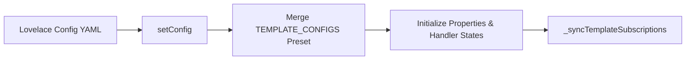

# YAMP Architecture & Codebase Index

This document provides a comprehensive structural mapping of subsystems, state lifecycles, and key functions across Yet Another Media Player (YAMP).

---

## 1. High-Level Subsystem Map

| Subsystem / Area | Primary File(s) | Key Functions / Methods | Description |
| :--- | :--- | :--- | :--- |
| **Card Lifecycle & Orchestration** | [`src/yet-another-media-player.js`](../src/yet-another-media-player.js) | `setConfig`, `set hass`, `connectedCallback`, `disconnectedCallback`, `updated`, `render` | Entry point Lit element managing state, subscriptions, and layout rendering. |
| **Config Schema & Presets** | [`src/config-schema.js`](../src/config-schema.js) | `CARD_CONFIG_DEFAULTS`, `TEMPLATE_CONFIGS`, `normalizeCardConfig` | Single source of truth for config defaults, preset definitions, and template support flags. |
| **Type Definitions** | [`src/types.d.ts`](../src/types.d.ts) | `YampCardConfig`, `HassEntity`, `TemplateContext` | TypeScript interfaces for data structures, Home Assistant states, and actions. |
| **Template Engine** | [`src/yet-another-media-player.js`](../src/yet-another-media-player.js) | `_subscribeToTemplate`, `_evaluateJsTemplate`, `_getTemplateContext`, `_syncTemplateSubscriptions` | Dual-engine resolver (Jinja2 via WebSocket subscriptions, JavaScript via `[[[ ... ]]]`). |
| **Artwork & Metadata** | [`src/yet-another-media-player.js`](../src/yet-another-media-player.js), [`src/yamp-utils.js`](../src/yamp-utils.js) | `_resolveArtwork`, `_applyIdleScreen`, `getArtworkUrl`, `isValidArtworkUrl` | Artwork resolution, Music Assistant priority, title-matching fallback blocker, and idle screen state machine. |
| **Player Chips & Tabs** | [`src/chip-row.js`](../src/chip-row.js), [`src/action-chip-row.js`](../src/action-chip-row.js) | `renderChipRow`, `renderActionChipRow`, `createHoldToPinHandler` | Top/bottom player selection chips, pin/hold handlers, custom action chips. |
| **Playback & Volume Controls** | [`src/controls-row.js`](../src/controls-row.js), [`src/volume-row.js`](../src/volume-row.js), [`src/progress-bar.js`](../src/progress-bar.js) | `renderControlsRow`, `renderVolumeRow`, `renderProgressBar` | Transport buttons (play, pause, next, prev, repeat, shuffle), volume sliders/steppers, progress scrubbers. |
| **Search & Media Browser** | [`src/search-sheet.js`](../src/search-sheet.js) | `renderSearchOptionsOverlay`, `searchMedia`, `renderSearchResultItem` | Standalone and embedded search sheet, Music Assistant favorites, and track dispatching. |
| **Lyrics Synchronization** | [`src/lyrics-view.js`](../src/lyrics-view.js), [`src/lyrics-parser.js`](../src/lyrics-parser.js) | `parseLrc`, `_syncActiveLyric` | Synchronized LRC parser, auto-scroll lyrics overlay, time-based highlights, and dynamic absolute layout. |
| **Queue & Drag-and-Drop** | [`src/yamp-queue-drag.js`](../src/yamp-queue-drag.js), [`src/yamp-sortable.js`](../src/yamp-sortable.js) | `QueueDragMixin`, `initSortable` | Virtualized queue list, drag reordering, track removal, and play-next handlers. |
| **Card Editor** | [`src/yamp-editor.js`](../src/yamp-editor.js) | `render`, `_renderTemplateToggle`, `_valueChanged` | Visual configuration editor with tabbed settings, searchable options, and Jinja/JS template toggles. |
| **Styles** | [`src/yamp-card-styles.js`](../src/yamp-card-styles.js) | `yampCardStyles` | Master CSS stylesheet for cards, chips, controls, search overlays, and themes. |

---

## 2. Core State & Data Lifecycles

### 2.1 Configuration Lifecycle


### 2.2 Template Resolution Lifecycle
```mermaid
flowchart TD
    T[Template Field Configured] --> CHK{Is Expression JS [[[ ]]] or Jinja {{ }} ?}
    CHK -->|JavaScript| JS[_evaluateJsTemplate]
    JS --> CACHE[Update Resolve Cache]
    CHK -->|Jinja2| WS[Home Assistant render_template WS]
    WS --> CACHE
    CACHE --> RENDER[Card Renders with Resolved Value]
```

### 2.3 Artwork & Metadata Resolution
1. **Active Entity vs Preferred Metadata Source:**
   If `prefer_ma_metadata` is set, the card checks the linked Music Assistant entity for track title, artist, and artwork.
2. **Title-Match Fallback Validation:**
   When falling back from a preferred metadata source to the physical playback entity, `media_title` MUST match. If titles differ, fallback is blocked to prevent stale artwork leaks.
3. **Idle Artwork:**
   If `show_idle_artwork_when_not_playing` is true, the card presents the configured idle artwork on a per-chip basis when that entity is not playing.

---

## 3. Important Implementation Rules

1. **Dual-Engine Template Support:**
   Any templated field must support both server-side Jinja2 (`{{ ... }}`) and client-side JavaScript (`[[[ ... ]]]`). All check blocks must inspect for both Jinja markers (`{{`, `{%`) and JS markers (`[[[`).
2. **Editor Input Visibility:**
   When a setting is not applicable due to another option, render it with `.disabled=${true}` rather than hiding it entirely.
3. **Search Rendering Consistency:**
   Shared search result items are rendered via `renderSearchResultItem` in [`src/search-sheet.js`](../src/search-sheet.js).
